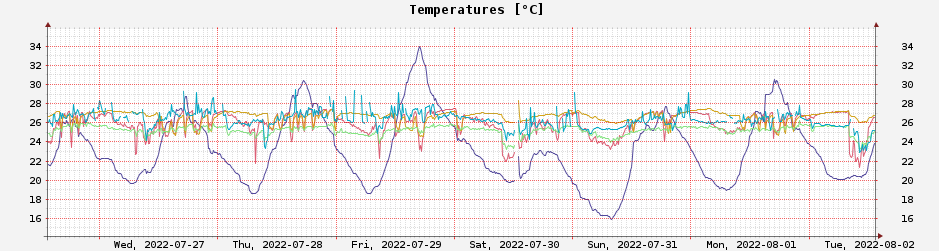

# Cloudy with a Chance of Confidentiality

This is a confidential platform for collecting sensor measurements and which
allows queries on aggregated data only. It is built on top of Cipher - the
confidential ParaTime running on the [Oasis network](https://oasisprotocol.org).

## Why confidential?

Accurate sensor readings can leak important business secrets or personal habits.

## Why blockchain?

Vendor-free, public accessibility. Not much data, block-time lag is not an issue.

## Architecture

* `hw` folder includes everything needed to configure your ESP8266 (running
  NodeMCU) controllers to receive and send measurements to the server.
* `server` is written in Go, receives measurements from the sensors and submits
  them in a batch to the blockchain - in our case the Cipher ParaTime.
* `contract` is a confidential smart contract written in Rust which resides on
  the blockchain, stores the raw sensor data and exposes aggregated queries on
  that data so that the privacy is preserved.
